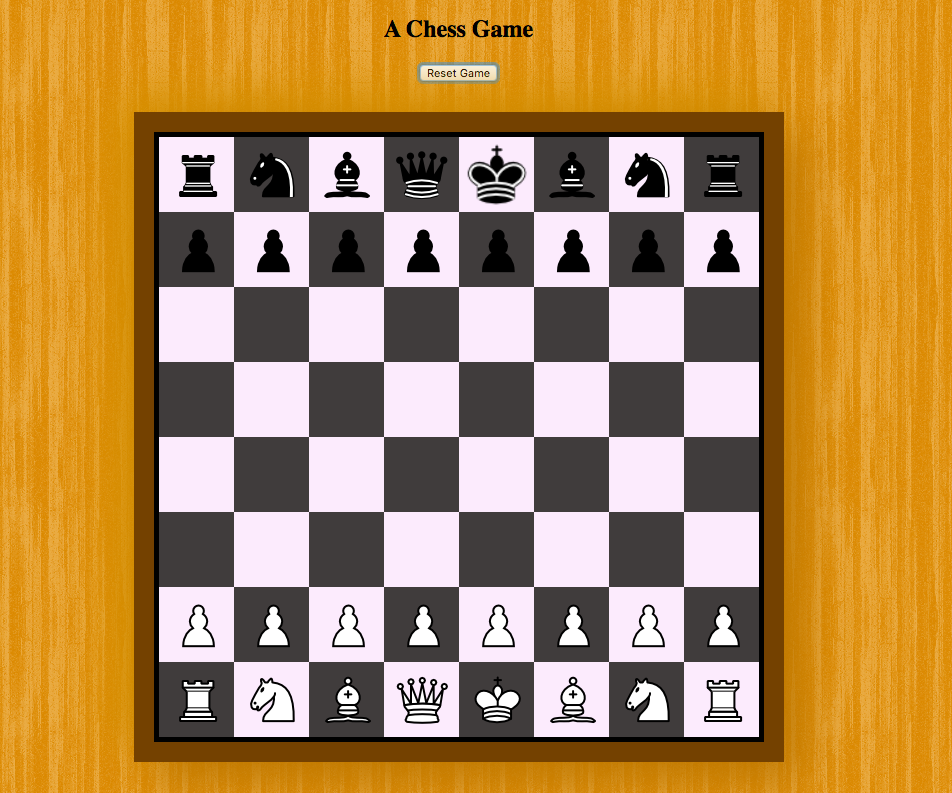

# js-chess
Built a basic chess game to play around with Javascript Events and DOM Manipulation

Written in vanilla JS. As of now, all basic rules have been implemented. And you can play with a friend. No computer competitor .... yet! 